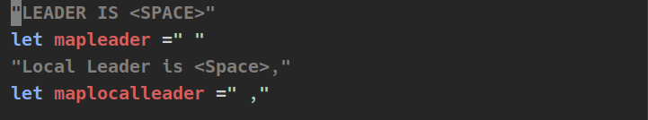
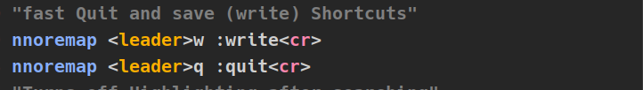
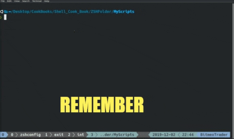
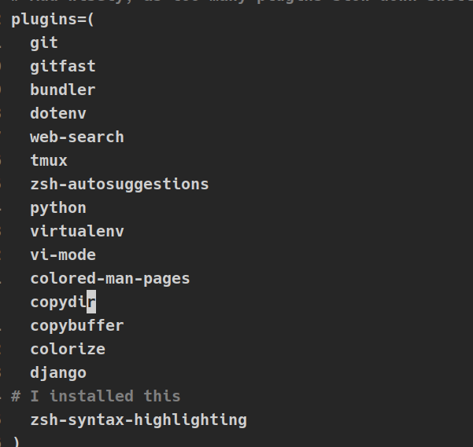

## *Introduction* 

This is the setup that I have been working on, I started using NeoVim and Vim at the start of 2019, and can not stop trying make the best Config/ workflow I have a problem, I am on my 25th config files 
(.vimrc /init.vim)

#### **The Configuration Layout**
- [Neovim](https://neovim.io/) a text editor, Neovim seems to come with a bit more common sense defaults and is pretty easy to install plugins. 

- [tmux](https://github.com/tmux/tmux/wiki)(a terminal multiplexer.) Neovim comes with a build in terminal and a lot of Neovim users tend to stop using tmux, but I like the ability to call new terminal window's, and it's easy to navigate from window to window 
- [zsh](https://gist.github.com/derhuerst/12a1558a4b408b3b2b7e) (a better shell, command line IMO. Just use it.  
- [oh-my-ash](https://github.com/robbyrussell/oh-my-zsh) it's kind of a plugin manger, but more. It will come with bunch of plugins that you can choose to use by adding them in the .zshrc file, but do not use to many as it can slow things up   

- [Ranger](https://github.com/ranger/ranger/)(A terminal file manger) this is a great tool for navigating fil, bit slow when getting into bigger directorys, NNN might be a better option still test.

### *Neovim Setup*
I had first started to try and keep this to as small plugin wise as possble and with some basic mappings it has kind of grown into a bit more then that
[Twitter](https://twitter.com/FreelanceForBTC) 

**Vim Tip** 
If you are a new Vim / Neovim user try these mappings out in your .vimrc or init.vim. 

I have set my leader to space and made a mapping to the :write command to use when I use the space bar and w in normal mode, it will execute the write command, so save a file, lot faster than :w enter.
 
<right>

**If you would like some more of these mappings check out the init.vim**

### *My Tmux Setup*

**A Better Prefix Mapping** 

Instead of Ctrl-b for the prefix, witch is madness I changed it to Ctrl-a
 

It's pretty small just a few key mappings a few plugins that work witn Neovim or Vim and settings for opening splits  and new windows in the directory you are in instead of the home directory.
### *Zsh* Shell

*_Aliases For opening files from the command line_*

 

#### *_Aliase Examples_* 

### *oh-my-zsh*
If you have not used Z-Shell (zsh) before I recommend using this for a plugin manger, it will come with bunch of common sense plugins that you choose to load.

#### *_Plugin Examples_*

### *Ranger*

#### **The Plugin Manger**
[Vim-plug](https://github.com/junegunn/vim-plug)

