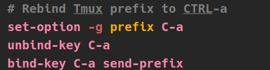

## *Introduction* 

This is the setup that I have been working on, I started using NeoVim and Vim at the start of 2019, and can not stop trying make the best Config/ workflow I have a problem, have am on my 25th cinfig file(.vimrc /init.vim)

#### **The Configuration Layout**
-  a text editor, Neovim seems to come with a bit more common sense defaults and is pretty easy to install plugins. 

- (a terminal multiplexer.) Neovim comes with a build in terminal and a lot of Neovim users tend to stop using tmux, but I like the ability to call new terminal window's, and it's easy to navigate from window to window 
-  (a better shell, command line IMO. Just use it.  
-  it's kind of a plugin manger, but more. It will come with bunch of plugins that you can choose to use by adding them in the .zshrc file, but do not use to many as it can slow things up   

### *Neovim Setup*
This is a pretty new init.vim file, tried to keep it as easy to understand  and well commented as possible, if you have any inquires, ask my on  

**Vim Tip** 
If you are a new Vim / Neovim user try these mappings out in your .vimrc  or init.vim, I have set my leader to space and made a mapping to the :write command to use when I use the space bar and w in normal mode, it will execute the write command, so save file, lot faster than :w enter.*Check out the rest of my init.vim file.*
<right>

### *My tmux setup*

It's pretty small just a few key mappings and settings for opening splits in the directory you are in.

* Instead of CTRL-b for the prefix, witch is madness I changed it to CTRL-a * Take a look at my .tmux.conf for more details.

### *zsh*
### *oh-my-zsh*
### *ranger*

#### **The Plugin Manger**

